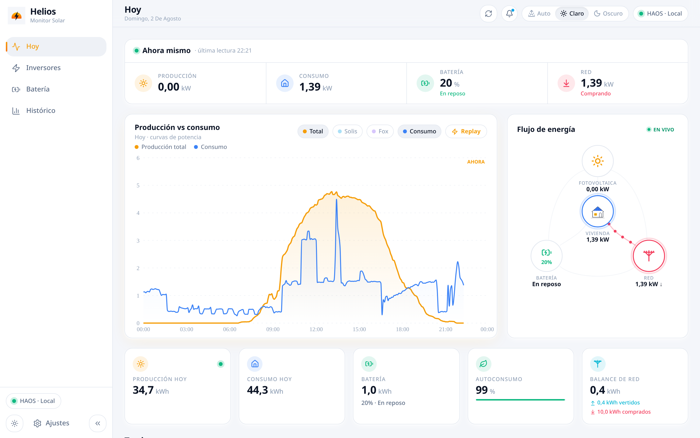
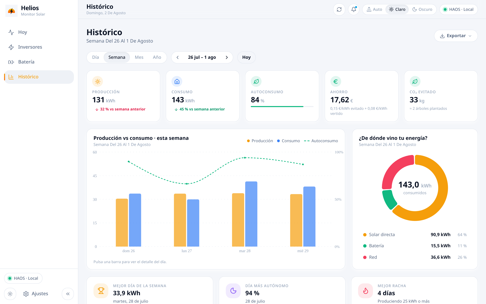
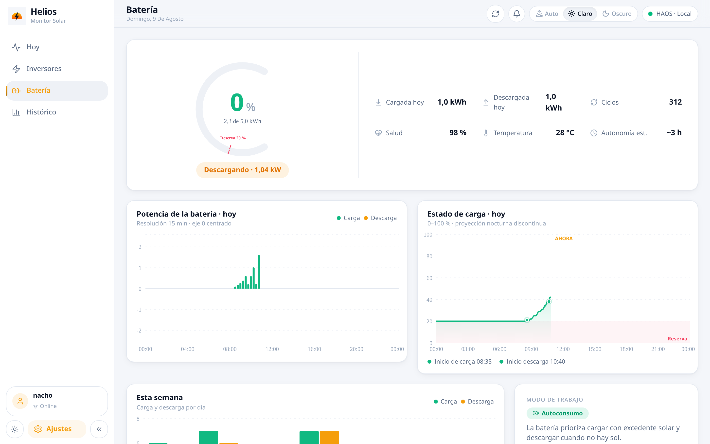

# Helios

<p align="center">
  <a href="README.md">English</a> |
  <a href="README.es.md">Español</a>
</p>

<p align="center">
  <picture>
    <source media="(prefers-color-scheme: dark)" srcset="assets/hero-es-dark.png">
    <source media="(prefers-color-scheme: light)" srcset="assets/hero-es-light.png">
    
  </picture>
</p>

> Este README no es para vender el proyecto: es para que un futuro
> mantenedor entienda en cinco minutos **por qué existe esto, de dónde
> salió y por qué está hecho como está hecho**, sin tener que re-leerse
> todo el código.

Helios es el monitor solar de una instalación doméstica: dos inversores
(Solis 4,4 kWp + Fox 2,7 kWp), una batería de 5 kWh, más de 798 días de
histórico, datos en vivo desde Home Assistant y el ahorro en euros
calculado contra la tarifa eléctrica real. Un único servicio Node +
SQLite corriendo en un LXC en casa. Sin nube.

> **Hecho a medida para una instalación.** Helios corre mi propia
> configuración — dos inversores concretos y una batería — y esos datos
> están hardcodeados. No es un monitor solar genérico "plug-and-play", y de
> momento no tengo interés inmediato en hacerlo (la configurabilidad del
> hardware está en la [hoja de ruta](#hoja-de-ruta), pero sin hacer). Es
> poco probable que te sirva tal cual. Forkea el repo y adáptalo a tu
> instalación.

## ¿Por qué existe?

Las apps de los fabricantes (Solis Cloud y similares):

- Viven en la nube del fabricante: si cae su servicio o cambian la API, te
  quedas sin tus datos. Que encima son **tuyos**, y ni siquiera los puedes
  exportar bien.
- Actualizan cada 5+ minutos y con retraso. Nada de "ahora mismo".
- No mezclan ambos inversores ni cruzan la producción con el precio real
  de la luz para decirte cuánto **dinero** te estás ahorrando.

Helios nace para tener **en casa, en local y para siempre** la telemetría
de la instalación: qué produce cada inversor, qué consume la casa, cómo va
la batería y cuánto vale en euros cada kWh autoconsumido.

## Cómo ha crecido

1. **Home Assistant (HAOS)** ya integraba los dos inversores, así que HAOS
   es la **fuente de verdad del dato en vivo** (sensores de potencia,
   batería, red). Helios no habla con los inversores: habla con HAOS.
2. La primera versión fue un panel rápido de "producción vs consumo".
   Creció a multiusuario con roles, histórico, batería, precios y PWA.
3. El histórico diario se importó desde HAOS y se sigue alimentando cada
   día: **798+ días** en una SQLite que es **intocable** (vive en
   `/opt/helios/data/helios.db` del host de producción; antes de cualquier
   migración, backup. Hay réplica Litestream con PITR a un disco del host
   de backup).
4. Un **scraper de Solis Cloud** (un LXC aparte + add-on HAOS) complementa el
   dato cuando la integración local se queda corta.

## Por qué este stack (y no otro)

| Decisión | Motivo |
|---|---|
| **Node 22 + Hono** | Es una app de negocio/vista, no un colector 24/7: la lógica valiosa es la de agregados y saneado de datos, ya validada durante 798 días. Reescribirla en Go era riesgo puro sin ganancia (decisión cerrada 1-Ago-2026: Go = colectores/infra, Node = negocio). Hono porque es pequeño, rápido y sin magia. |
| **better-sqlite3 (ESM plano)** | Una BD embebida transaccional es todo lo que necesita una app doméstica: cero servicios extra, backup trivial, y los 798 días caben en 90 MB. JS plano en vez de TS en el server: menos build, menos fricción; los contratos se garantizan con **schemas zod compartidos** (`shared/schemas.js`). |
| **React 19 + Vite + Tailwind** | El mismo front de todas las apps de la casa (`webapp-shell` compartida): una sola forma de hacer shell, tema, ajustes y login. |
| **HAOS como fuente del live** | HAOS ya mantiene las integraciones con Solis/Fox y sus reconexiones. Duplicar eso en Helios sería mantener dos drivers. Helios consume, no integra. |
| **systemd + LXC, sin Docker** | Un binario de Node con `node_modules` y una unit hardenizada (`ProtectSystem`, `ReadWritePaths`) es más simple de razonar y de revertir que un contenedor, y la BD vive fuera del código en `/opt/helios/data`. |
| **Litestream → SFTP** | Réplica continua de la SQLite con point-in-time-recovery: la BD es lo único insustituible del sistema. |

## Qué cubre (requisitos de verdad)

- **Multiusuario con roles** (admin/user), sesiones con cookie httpOnly,
  bcrypt, rate-limit de login, audit log y recovery de admin **solo desde
  localhost** (pensado para entrar por SSH al CT).
- **i18n ES/EN/zh-CN** con idioma por usuario guardado en BD.
- **Dato en vivo vía WebSocket a HAOS** (no REST lento): la vista Hoy y el
  flujo de energía se mueven en tiempo real.
- **Histórico serio**: 798+ días con agregados diarios (producción,
  consumo, import/export de red, carga/descarga de batería, por inversor),
  autoconsumo, ahorro en € con precios reales y CO₂ evitado.
- **PWA instalable**, tema claro/oscuro/auto (el auto va por hora solar,
  no por el sistema), densidad y shell común con el resto de apps de la
  casa.
- **Sin Docker**: servicio systemd en un LXC de Proxmox, con la BD fuera
  del código para que las actualizaciones no la toquen.

## Capturas (uso real, instalación en producción)

**Histórico: agregados semanales, ahorro y CO₂**

<picture>
  <source media="(prefers-color-scheme: dark)" srcset="assets/screenshot-history-es-dark.png">
  <source media="(prefers-color-scheme: light)" srcset="assets/screenshot-history-es-light.png">
  
</picture>

**Batería: estado de carga y flujos**

<picture>
  <source media="(prefers-color-scheme: dark)" srcset="assets/screenshot-battery-es-dark.png">
  <source media="(prefers-color-scheme: light)" srcset="assets/screenshot-battery-es-light.png">
  
</picture>

Las capturas son de la **instalación real** (server de desarrollo contra
el HAOS local y una copia de la BD con 798 días). No hay dataset demo
aparte: los datos de verdad cuentan mejor para qué sirve cada vista.

## Arquitectura en 30 segundos

```
Inversores (Solis/Fox) ──integraciones──▶ HAOS ──WebSocket──▶ Helios server (Hono)
                                            ▲                    │ better-sqlite3
                                  scraper Solis Cloud             ▼
                                    (LXC aparte)            SQLite (798+ días)
                                                                   │ Litestream
                                                                   ▼
                                                    SFTP a un disco (host backup)
```

- `server/`: API Hono + auth multiusuario + agregados + saneado de datos.
- `app/`: React 19 (vistas: Hoy, Inversores, Batería, Histórico, Ajustes).
- `shared/schemas.js`: contrato zod server↔front.
- Detalle completo en `ARCHITECTURE.md` y `STACK.md`.

## Operación (lo justo para no romper nada)

- Producción: un CT de Proxmox, servicio `helios.service`, puerto
  80 (solo LAN). La BD **no se toca** sin backup previo.
- Desarrollo local: `PORT=8199 AUTH_PASS=… node server/src/index.js`
  desde `server/` (la BD de `server/data/` es una copia de desarrollo).
- Si la contraseña de admin se pierde: `curl -X POST
  http://127.0.0.1:<puerto>/api/auth/recover` **desde el propio host**
  (SSH) devuelve una temporal. No funciona a través de proxy.
  ⚠️ El recover **resetea la contraseña de admin** a ese valor temporal:
  tras usarlo, cambia la contraseña de nuevo en Ajustes.
- Actualizar = desplegar el build nuevo y reiniciar el servicio; la BD y
  el `.env` (`/opt/helios/`) sobreviven siempre.

## Hoja de ruta

| Fase | Qué | Estado |
|---|---|---|
| 1 | Panel live de solo lectura (producción vs consumo) | Hecho |
| 2 | Backend real, multiusuario, histórico, batería, alertas, PWA, endurecimiento | Hecho (~0.6.x) |
| 3 | Inversores y placas configurables (siempre bajo HAOS) | Planificado |
| 4 | Multi-instalación: varios HAOS o varios Helios vía API | En exploración |

Ver [ROADMAP.md](ROADMAP.md) para más detalle.

## Licencia

AGPL-3.0 — ver [LICENSE](LICENSE).
