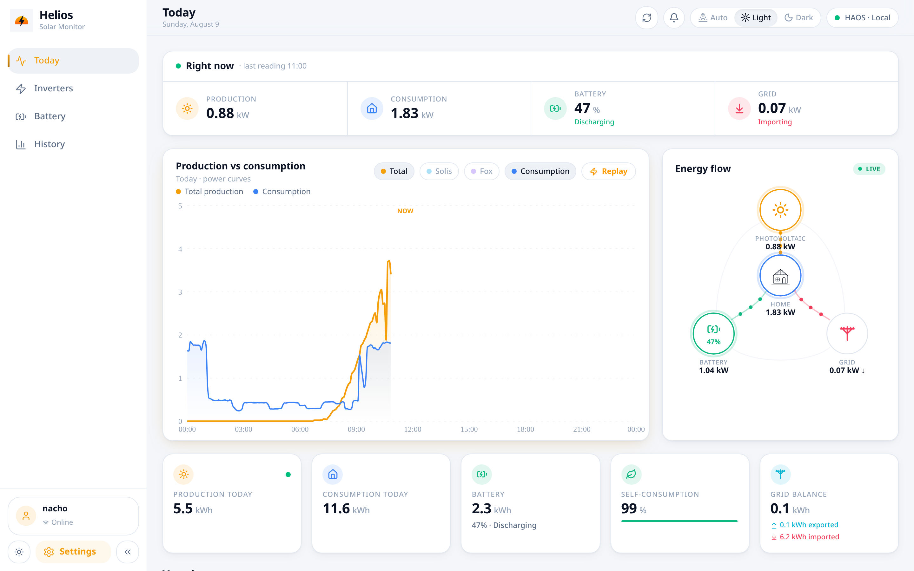
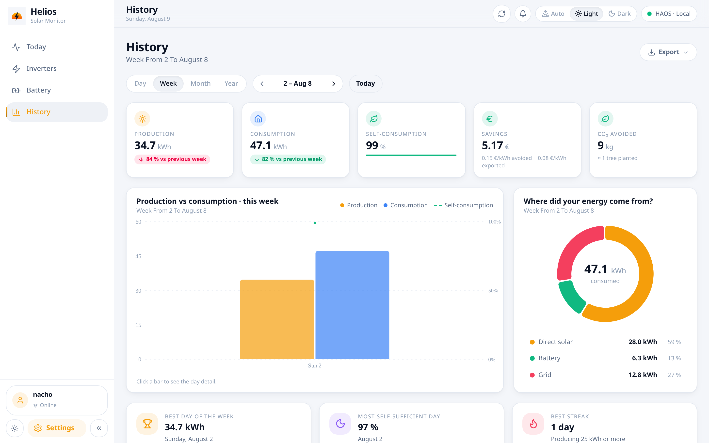
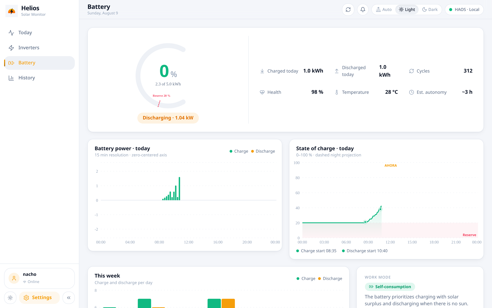

# Helios

<p align="center">
  <a href="README.md">English</a> |
  <a href="README.es.md">Español</a>
</p>

<p align="center">
  <a href="https://helios.cloudless.club"></a>
  <a href="https://demo.helios.cloudless.club"></a>
  <a href="https://github.com/gnacho/helios/releases"></a>
  <a href="https://github.com/gnacho/helios/actions/workflows/release.yml"></a>
  <a href="LICENSE"></a>
  <a href="https://ko-fi.com/gnacho"></a>
</p>

<p align="center">
  <picture>
    <source media="(prefers-color-scheme: dark)" srcset="assets/hero-en-dark.png">
    <source media="(prefers-color-scheme: light)" srcset="assets/hero-en-light.png">
    
  </picture>
</p>

> This README is not meant to sell the project: it's so that a future
> maintainer understands in five minutes **why this exists, where it came
> from, and why it's built the way it's built**, without re-reading the
> whole codebase.

Helios is a solar monitor for a home installation: two inverters (Solis
4.4 kWp + Fox 2.7 kWp), a 5 kWh battery, 798+ days of history, live data
from Home Assistant, and savings in euros computed against the real
electricity tariff. One Node + SQLite service running in an LXC at home.
No cloud.

> **Started as one install, now mostly configurable.** Helios began as my own
> setup (two specific inverters and one battery) and those details were
> hardcoded. Since 0.7.x the installation topology (inverters, battery, grid
> source, sensor mapping) is resolved from `install_config` — any HAOS
> installation can run it by configuring its sensors, without touching code.
> The dashboard, inverters page and settings adapt to the resolved topology
> (N inverters). It is not a fully polished plug-and-play product, but since
> 0.7.2 an admin can edit the topology (inverters, battery, grid source, HAOS
> sensor mapping) from Settings, no code or JSON required. Fork it and adapt
> it to your own installation.

## Why does this exist?

The manufacturers' apps (Solis Cloud and friends):

- Live in the vendor's cloud: if their service goes down or the API
  changes, you lose your data. Data that is **yours**, and that you can't
  even export properly.
- Update every 5+ minutes, delayed. Nothing about "right now".
- Don't mix both inverters, and don't cross production with the real
  price of electricity to tell you how much **money** you're saving.

Helios exists to keep the installation's telemetry **at home, local,
forever**: what each inverter produces, what the house consumes, how the
battery is doing, and what every self-consumed kWh is worth in euros.

## How it grew

1. **Home Assistant (HAOS)** already integrated both inverters, so HAOS
   is the **source of truth for live data** (power, battery, grid
   sensors). Helios doesn't talk to the inverters: it talks to HAOS.
2. The first version was a quick "production vs consumption" panel. It
   grew into multi-user with roles, history, battery, prices and PWA.
3. The daily history was imported from HAOS and keeps being fed every
   day: **798+ days** in a SQLite that is **untouchable** (it lives in
   `/opt/helios/data/helios.db` on the production host; before any
   migration, backup. There's a Litestream replica with PITR to a disk
   on the backup host).
4. A **Solis Cloud scraper** (a separate LXC + HAOS add-on) complements the data
   when the local integration falls short.

## Why this stack (and not another)

| Decision | Reason |
|---|---|
| **Node 22 + Hono** | This is a business/view app, not a 24/7 collector: the valuable logic is aggregation and data sanitation, already validated over 798 days. Rewriting it in Go was pure risk with no gain (decision closed 1-Aug-2026: Go for collectors/infra, Node for business). Hono because it's small, fast, and magic-free. |
| **better-sqlite3 (plain ESM)** | An embedded transactional DB is all a home app needs: zero extra services, trivial backups, and 798 days fit in 90 MB. Plain JS instead of TS on the server: less build, less friction; contracts are enforced with **shared zod schemas** (`shared/schemas.js`). |
| **React 19 + Vite + Tailwind** | The same front as every app in the house (shared `webapp-shell`): one way of doing shell, theme, settings and login. |
| **HAOS as the live source** | HAOS already maintains the Solis/Fox integrations and their reconnections. Duplicating that in Helios means maintaining two drivers. Helios consumes, it doesn't integrate. |
| **systemd + LXC, no Docker** | A Node binary with `node_modules` and a hardened unit (`ProtectSystem`, `ReadWritePaths`) is simpler to reason about and to roll back than a container, and the DB lives outside the code in `/opt/helios/data`. |
| **Litestream → SFTP** | Continuous SQLite replication with point-in-time recovery: the DB is the only irreplaceable part of the system. |

## What it covers (real requirements)

- **Multi-user with roles** (admin/user), httpOnly cookie sessions,
  bcrypt, login rate-limit, audit log, and admin recovery **from
  localhost only** (meant for SSH into the CT).
- **i18n ES/EN/zh-CN** with per-user language stored in the DB.
- **Live data over WebSocket to HAOS** (not slow REST): the Today view
  and the energy flow move in real time.
- **Serious history**: 798+ days with daily aggregates (production,
  consumption, grid import/export, battery charge/discharge, per
  inverter), self-consumption, savings in € at real electricity prices, and CO₂
  avoided.
- **Installable PWA**, light/dark/auto theme (auto follows the solar
  hour, not the OS), density, shared shell with the other house apps.
- **No Docker**: systemd service in a Proxmox LXC, DB outside the code so
  updates never touch it.

## Screenshots (real usage, production install)

**History: weekly aggregates, savings and CO₂**

<picture>
  <source media="(prefers-color-scheme: dark)" srcset="assets/screenshot-history-en-dark.png">
  <source media="(prefers-color-scheme: light)" srcset="assets/screenshot-history-en-light.png">
  
</picture>

**Battery: charge state and flows**

<picture>
  <source media="(prefers-color-scheme: dark)" srcset="assets/screenshot-battery-en-dark.png">
  <source media="(prefers-color-scheme: light)" srcset="assets/screenshot-battery-en-light.png">
  
</picture>

The screenshots come from the **real install** (dev server against the
local HAOS and a copy of the 798-day DB). There's no demo dataset: real
data explains better what each view is for.

## Architecture in 30 seconds

```
Inverters (Solis/Fox) ──integrations──▶ HAOS ──WebSocket──▶ Helios server (Hono)
                                            ▲                    │ better-sqlite3
                                  Solis Cloud scraper             ▼
                                    (separate LXC)             SQLite (798+ days)
                                                                   │ Litestream
                                                                   ▼
                                                    SFTP to a disk (backup host)
```

- `server/`: Hono API + multi-user auth + aggregation + data sanitation.
- `app/`: React 19 (views: Today, Inverters, Battery, History, Settings).
- `shared/schemas.js`: zod contract server↔front.
- Full detail in `ARCHITECTURE.md` and `STACK.md`.

## Installation

Helios is a Node service with an embedded SQLite DB. It does **not** talk to
the inverters directly: it connects to your Home Assistant over its WebSocket
API and reads the sensors HAOS already exposes. Only two HAOS settings matter:

- `HAOS_URL` — your HAOS address, e.g. `http://192.168.10.244:8123`
  (`http://` is upgraded to `ws://` internally).
- `HAOS_TOKEN` — a **long-lived access token**, generated in HAOS under
  Profile → Security → Long-lived access tokens.

Copy `server/.env.example` to `.env` and fill those two values (plus the auth
ones). On startup Helios authenticates with the token and subscribes to the
entities declared in the topology. You can see the resolved entity list and
test the connection under Settings → Connection & data; an admin edits the
topology itself from Settings. The DB lives in `server/data/` (or `DATA_DIR`)
and the `.env` always survives updates.

## Operations (just enough to not break anything)

- Production: a Proxmox CT, `helios.service`, port 80 (LAN
  only). The DB **is never touched** without a prior backup.
- Local dev: `PORT=8199 AUTH_PASS=… node server/src/index.js` from
  `server/` (the DB in `server/data/` is a development copy).
- If the admin password is lost: `curl -X POST
  http://127.0.0.1:<port>/api/auth/recover` **from the host itself**
  (SSH) returns a temporary one. Doesn't work through a proxy.
  ⚠️ The recover **resets the admin password** to that temporary value:
  after using it, change the password again in Settings.
- Update = deploy the new build and restart the service; the DB and the
  `.env` (`/opt/helios/`) always survive.

## Configuring the installation (topology)

Helios reads the installation topology (inverters, battery, grid source, HAOS
sensor mapping) from `install_config`, a JSON in the kv store. On first boot it
auto-resolves it: an existing DB keeps the legacy profile (scraper + Solis/Fox
+ battery), an empty DB gets a generic profile (no scraper, grid from plain
sensors). To set your own sensors, write a `topology` object:

```
PUT /api/config  (auth admin)
{
  "topology": {
    "inverters": [
      { "key": "inv1", "name": "My inverter", "kwp": 5.0, "powerId": "sensor.inverter_power", "powerUnit": "kW", "energyId": "sensor.inverter_energy_today", "energyAcc": "state", "deepIds": ["sensor.inverter_energy_total"] }
    ],
    "battery": { "enabled": false },
    "grid": { "mode": "sensor", "sensorId": "sensor.grid_net" },
    "consumption": { "powerIds": ["sensor.house_power"], "powerUnit": "W", "energyIds": ["sensor.house_energy"] },
    "sun": "sun.sun",
    "weather": "weather.forecast"
  }
}
```

`GET /api/install` returns the resolved topology and the entity list the UI
shows in Settings. `powerUnit` is `kW` or `W`; battery charge/discharge states
(`chargingStates`/`dischargingStates`) accept any strings so HAOS languages
other than Spanish work. Everything comes from HAOS: `grid.mode: "attrs"`
reads grid power/direction from a sensor's attributes (the Solis scraper is
just such a sensor), `grid.mode: "sensor"` reads plain grid sensors, and
`statusAttrsId` optionally provides inverter online/station status.

## Roadmap

| Phase | Focus | Status |
|---|---|---|
| 1 | Live read-only panel (production vs consumption) | Done |
| 2 | Real backend, multi-user, history, battery, alerts, PWA, hardening | Done (~0.6.x) |
| 3 | Configurable hardware (still under HAOS) | Done (0.7.x) |
| 4 | Multi-installation: several HAOS or several Helios via API | Up next |

See [ROADMAP.md](ROADMAP.md) for detail.

## Big thanks

Helios wouldn't exist without [Home Assistant](https://www.home-assistant.io/).
It already does the hard part: talking to the inverters, handling their
reconnects, and exposing clean sensors. Helios just reads what HAOS already
collects. If this project is useful to you, the real credit goes to the people
who keep Home Assistant running.

## License

AGPL-3.0 — see [LICENSE](LICENSE).
