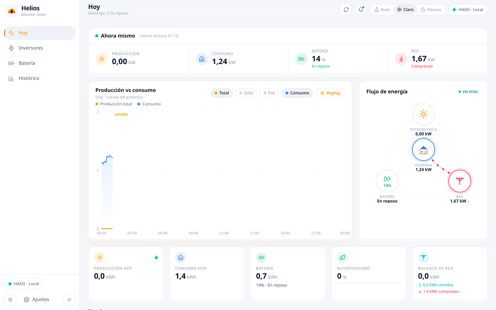
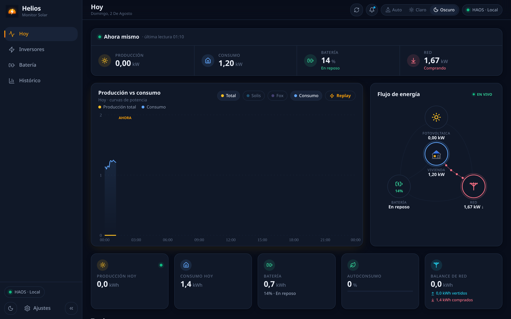
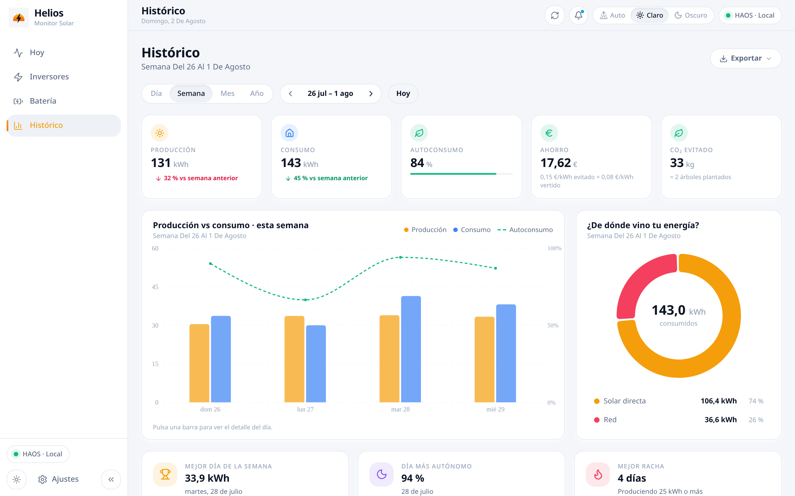
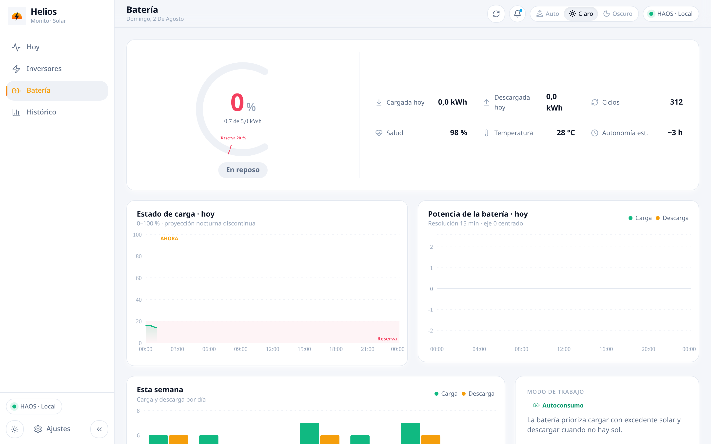

# Helios — Monitor Solar

<picture>
  <source media="(prefers-color-scheme: dark)" srcset="assets/dashboard-dark.png">
  <source media="(prefers-color-scheme: light)" srcset="assets/dashboard-light.png">
  
</picture>

> Repo **privado**. Este README no es para vender el proyecto: es para que el
> Nacho del futuro entienda en cinco minutos **por qué existe esto, de dónde
> salió y por qué está hecho como está hecho**, sin tener que re-leerse todo
> el código ni la memoria del asistente.

## Por qué existe (la motivación real)

Tenemos placas solares con **dos inversores** (Solis 4,4 kWp + Fox 2,7 kWp) y
una **batería de 5 kWh**. Las apps de los fabricantes (Solis Cloud y similares):

- Viven en la nube del fabricante: si cae su servicio o cambian la API, te
  quedas sin tus datos — que encima son **tuyos** y no los puedes exportar bien.
- Actualizan cada 5+ minutos y con retraso; nada de "ahora mismo".
- No mezclan ambos inversores ni cruzan con el precio real de la luz
  (tarifa Octopus) para decirte cuánto **dinero** te estás ahorrando.

Helios nace para tener **en casa, en local y para siempre** la telemetría de
la instalación: qué produce cada inversor, qué consume la casa, cómo va la
batería y cuánto vale en euros cada kWh autoconsumido.

## Origen (cómo ha crecido esto)

1. **Home Assistant (HAOS)** ya integraba los dos inversores, así que HAOS es
   la **fuente de verdad del dato en vivo** (sensores de potencia, batería,
   red). Helios no habla con los inversores: habla con HAOS.
2. La primera versión fue un panel rápido para ver "producción vs consumo".
   Creció a multiusuario con roles, histórico, batería, precios y PWA.
3. El histórico diario se importó desde HAOS y se sigue alimentando cada día:
   **798+ días de datos** en una SQLite que es **intocable** (vive en
   `/opt/helios/data/helios.db` del CT 226; antes de cualquier migración,
   backup — hay réplica Litestream con PITR al disco zfs_2tb de host-a).
4. Además existe un **scraper de Solis Cloud** (LXC 202 + add-on HAOS) que
   complementa el dato cuando la integración local se queda corta.

## Necesidades que cubre (requisitos de verdad)

- **Multiusuario con roles** (admin/user), sesiones con cookie httpOnly,
  bcrypt, rate-limit de login, audit log de mutaciones y recovery de admin
  **solo desde localhost** (pensado para entrar por SSH al CT).
- **i18n ES/EN/zh-CN** con idioma por usuario guardado en BD.
- **Dato en vivo** vía WebSocket a HAOS (no REST lento): la vista "Hoy" y el
  flujo de energía se mueven en tiempo real.
- **Histórico serio**: 798+ días con agregados diarios (producción, consumo,
  import/export red, carga/descarga de batería, por inversor), autoconsumo,
  ahorro en € con los precios de Octopus y CO₂ evitado.
- **PWA** instalable, tema claro/oscuro/auto (el auto es por hora solar, no
  por el sistema), densidad y shell común con el resto de apps de la casa.
- **Sin Docker**: servicio systemd en un LXC de Proxmox, con la BD fuera del
  código para que las actualizaciones no la toquen.

## Por qué este stack (y no otro)

| Decisión | Motivo |
|---|---|
| **Node 22 + Hono** (backend) | App de **negocio/vista**, no un colector 24/7: la lógica valiosa es la de agregados y saneado de datos, ya validada durante 798 días. Reescribirla en Go era riesgo puro sin ganancia (decisión cerrada 1-Ago-2026: Go = colectores/infra, Node = negocio; Helios queda descartada para Go). Hono porque es pequeño, rápido y sin magia. |
| **better-sqlite3 (ESM plano)** | Una BD embebida transaccional es todo lo que necesita una app doméstica: cero servicios extra, backup trivial, y los 798 días caben en 90 MB. JS plano en vez de TS en el server: menos build, menos fricción; los contratos se garantizan con **schemas zod compartidos** (`shared/schemas.js`) entre server y front. |
| **React 19 + Vite + Tailwind** | El mismo front de todas las apps de la casa (base común `webapp-stack`/`webapp-shell`): una sola forma de hacer shell, tema, ajustes y login. |
| **HAOS como fuente del live** | HAOS ya mantiene las integraciones con Solis/Fox y sus reconexiones. Duplicar eso en Helios sería mantener dos drivers. Helios consume, no integra. |
| **systemd + LXC, sin Docker** | Un binario de Node con `node_modules` y una unit hardenizada (`ProtectSystem`, `ReadWritePaths`) es más simple de razonar y de hacer rollback que un contenedor, y la BD vive en `/opt/helios/data` fuera del código. |
| **Litestream → SFTP** | Réplica continua de la SQLite con point-in-time-recovery: la BD es lo único insustituible del sistema. |

## Capturas (uso real, instalación en producción)

| Vista Hoy (dark / light) | Histórico semanal | Batería |
|---|---|---|
|  |  |  |

Las capturas son de la **instalación real** (server de desarrollo contra HAOS
local y una copia de la BD con 798 días). No hay dataset demo aparte: los
datos de verdad cuentan mejor para qué sirve cada vista.

## Arquitectura en 30 segundos

```
Inversores (Solis/Fox) ──integraciones──▶ HAOS ──WebSocket──▶ Helios server (Hono)
                                              ▲                    │ better-sqlite3
                                   scraper Solis Cloud             ▼
                                     (LXC 202 + add-on)      SQLite (798+ días)
                                                                    │ Litestream
                                                                    ▼
                                                        SFTP zfs_2tb (host-a)
```

- `server/` — API Hono + auth multiusuario + agregados + saneado de datos.
- `app/` — React 19 (vistas: Hoy, Inversores, Batería, Histórico, Ajustes).
- `shared/schemas.js` — contrato zod server↔front.
- Detalle completo en `ARCHITECTURE.md` y `STACK.md`.

## Operación (lo justo para no romper nada)

- Producción: **CT 226** (host-a), servicio `helios.service`, puerto 80
  (solo LAN). La BD **no se toca** sin backup previo.
- Desarrollo local: `PORT=8199 AUTH_PASS=… node server/src/index.js` desde
  `server/` (la BD de `server/data/` es una copia de desarrollo).
- Si la contraseña de admin se pierde: `curl -X POST
  http://127.0.0.1:<puerto>/api/auth/recover` **desde el propio host** (SSH)
  → devuelve una temporal. No funciona a través de proxy.
- Actualizar = desplegar el build nuevo y reiniciar el servicio; la BD y el
  `.env` (`/opt/helios/`) sobreviven siempre.

## Licencia

Privada (repo sin publicar). Si algún día se publica, la casa usa AGPL-3.0 —
pero esa decisión se toma entonces, no ahora.
